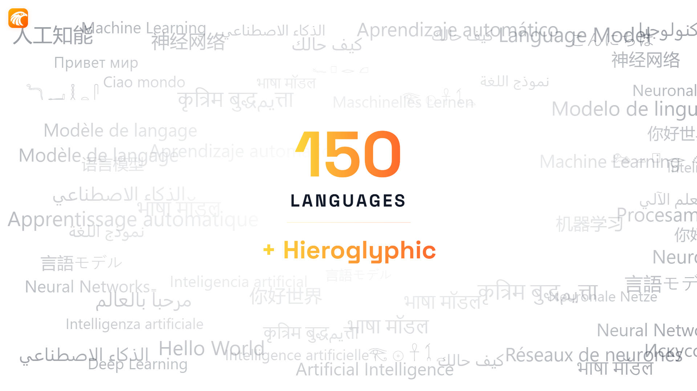

<div align="center">
  
  <h1>Horus-Hiero</h1>
  <p><b>Understanding the Language of the Pharaohs</b></p>
</div>

<p align="center">
  <a href="https://huggingface.co/collections/tokenaii/horus-hiero"></a>
  <a href="https://huggingface.co/tokenaii"></a>
  <a href="LICENSE"></a>
</p>

**Horus-Hiero** is a specialized AI model dedicated to translating ancient Egyptian hieroglyphs into modern languages. Developed by TokenAI, it bridges the gap between the language of the Pharaohs and today's world.

### 150+ Languages + Hieroglyphic Support


<br>

### 150 Languages + Hieroglyphic



<br>

### Example: Hieroglyph Translation


---

## Models

| Model | Size | Format | Description |
|-------|------|--------|-------------|
| [Horus-Hiero-9B](https://huggingface.co/tokenaii/Horus-Hiero-9B) | 9B params | Full weights (safetensors) | Full-precision 16-bit model for maximum quality |
| [Horus-Hiero-9B-GGUF](https://huggingface.co/tokenaii/Horus-Hiero-9B-GGUF) | 9B params | GGUF (Q2\_K to Q8\_0) | Quantized versions for efficient deployment |
| [Horus-Hiero-Mini-4B](https://huggingface.co/tokenaii/Horus-Hiero-Mini-4B) | 4B params | Full weights (safetensors) | Compact model for resource-constrained setups |
| [Horus-Hiero-Mini-4B-GGUF](https://huggingface.co/tokenaii/Horus-Hiero-Mini-4B-GGUF) | 4B params | GGUF (Q2\_K to Q8\_0) | Quantized versions of the Mini model |

### GGUF Quantization Variants

**Horus-Hiero-9B-GGUF:**

| Quant | Size | Download |
|-------|------|----------|
| Q8\_0 | ~8.9 GB | [Download](https://huggingface.co/tokenaii/Horus-Hiero-9B-GGUF/resolve/main/Horus-Hiero-9B-Q8_0.gguf) |
| Q6\_K | ~6.9 GB | [Download](https://huggingface.co/tokenaii/Horus-Hiero-9B-GGUF/resolve/main/Horus-Hiero-9B-Q6_K.gguf) |
| Q4\_K\_M | ~5.2 GB | [Download](https://huggingface.co/tokenaii/Horus-Hiero-9B-GGUF/resolve/main/Horus-Hiero-9B-Q4_K_M.gguf) |
| Q2\_K | ~3.6 GB | [Download](https://huggingface.co/tokenaii/Horus-Hiero-9B-GGUF/resolve/main/Horus-Hiero-9B-Q2_K.gguf) |

**Horus-Hiero-Mini-4B-GGUF:**

| Quant | Size | Download |
|-------|------|----------|
| Q8\_0 | ~4.2 GB | [Download](https://huggingface.co/tokenaii/Horus-Hiero-Mini-4B-GGUF/resolve/main/Horus-Hiero-Mini-4B-Q8_0.gguf) |
| Q6\_K | ~3.2 GB | [Download](https://huggingface.co/tokenaii/Horus-Hiero-Mini-4B-GGUF/resolve/main/Horus-Hiero-Mini-4B-Q6_K.gguf) |
| Q4\_K\_M | ~2.5 GB | [Download](https://huggingface.co/tokenaii/Horus-Hiero-Mini-4B-GGUF/resolve/main/Horus-Hiero-Mini-4B-Q4_K_M.gguf) |
| Q2\_K | ~1.8 GB | [Download](https://huggingface.co/tokenaii/Horus-Hiero-Mini-4B-GGUF/resolve/main/Horus-Hiero-Mini-4B-Q2_K.gguf) |

---

## Usage

### Generate Your Custom Integration Code
Configure execution parameters (device, thinking mode, context length) and generate your custom integration script instantly using the [Interactive Horus Hiero Code Builder](https://tokenai.llc/projects/horus-hiero).

We recommend using the **NeuralNode** framework for local inference. It simplifies loading and configuring models, handling memory optimization, and enabling reasoning modes with just a few lines of code.

### Installation

```bash
pip install -U neuralnode
```

### Install dependencies based on your model format:
- **For GGUF** (recommended for CPU/Low VRAM):
  ```bash
  pip install llama-cpp-python huggingface_hub
  ```
- **For Safetensors** (recommended for GPU/High VRAM):
  ```bash
  pip install torch accelerate safetensors
  ```

### Example: Running GGUF Model

```python
import neuralnode as nn

# Load Horus Hiero Mini 4B GGUF
model = nn.HorusModel(
    "Horus-Hiero-Mini-4B-Q4_K_M.gguf",
    device="cpu", # or "cuda" for GPU
    n_gpu_layers=0, # -1 to offload all layers to GPU
    n_ctx=1024,
).load()

response = model.chat(
    [{"role": "user", "content": "Explain Horus Hiero briefly."}],
    thinking=False, # Set to True to enable thinking mode
)

print(response.content)
```

### Example: Running Safetensors Model (GPU)

```python
import neuralnode as nn

# Load Horus Hiero 9B Safetensors
model = nn.HorusModel(
    "Horus-Hiero-9B",
    device="cuda",
    torch_dtype="auto",
    device_map="auto",
).load()

response = model.chat(
    [{"role": "user", "content": "Translate this hieroglyph: ..."}]
)

print(response.content)
```

---

## Links

- [Hugging Face Collection](https://huggingface.co/collections/tokenaii/horus-hiero)
- [TokenAI Organization](https://huggingface.co/tokenaii)
- [TokenAI Website](https://tokenai.llc)
- [GitHub](https://github.com/tokenaii)

---

## License

This project is licensed under the [Apache License 2.0](LICENSE).
